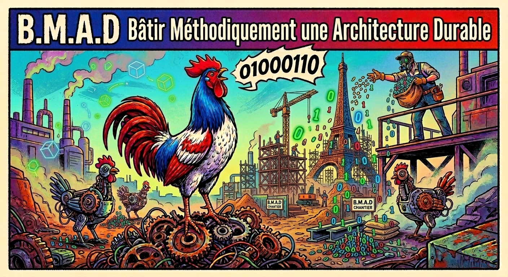

> **Fork de BMAD-METHOD "Build More Architect Dreams" (Création originale : Brian Madison / BMad Code, LLC)**

[](https://www.npmjs.com/package/bmad-fr)
[](LICENSE)

---

> ⚠️ **À lire avant d'utiliser ce fork**
> **La version originale parle déjà français !**
> Il est tout à fait possible d'utiliser la [version anglaise originale de BMAD](https://github.com/bmad-code-org/BMAD-METHOD) dans n'importe quelle langue. Il vous suffit de vous adresser aux agents en français pour qu'ils vous répondent naturellement dans cette langue.
> **Alors, pourquoi utiliser ce fork ?**
> Notre feuille de route se divise en deux étapes :
>
> 1. **Accessibilité (En cours) :** La traduction des prompts vise à faciliter la découverte et la compréhension des mécanismes pour les nouveaux utilisateurs francophones.
> 2. **Évolution (À venir) :** Après une compréhension approfondie de la structure d'origine, ce fork servira de laboratoire pour tester des modifications avancées, comme l'automatisation de certaines boucles et l'intégration de la méthodologie TDD (Test-Driven Development).
>
> _💡 Note : Si vous cherchez à utiliser le framework standard avec les toutes dernières mises à jour officielles, il est fortement recommandé de vous tourner vers le projet original._
>
> - [Version anglaise originale de BMAD](https://github.com/bmad-code-org/BMAD-METHOD)
>   📍 Consultez la [Feuille de Route du projet original](https://github.com/bmad-code-org/BMAD-METHOD/blob/main/docs/roadmap.mdx) →

---

**B.M.A.D : Bâtir Méthodiquement une Architecture Durable** — Un module de développement agile piloté par l'IA pour l'écosystème de modules BMad Method, le meilleur et le plus complet framework de développement agile piloté par l'IA avec une véritable intelligence adaptative à l'échelle qui s'ajuste des corrections de bugs aux systèmes enterprise.

100% gratuit et open source.
Pas de paywalls. Pas de contenu gated. Pas de Discord gated. Nous croyons en l'autonomisation de tout le monde, pas seulement de ceux qui peuvent payer pour une communauté ou des cours privés.

---

## Pourquoi la Méthode BMad ?

Les outils d'IA traditionnels font la réflexion à votre place, produisant des résultats moyens. Les agents BMad et les workflows facilités agissent comme des collaborateurs experts qui vous guident à travers un processus structuré pour faire émerger votre meilleure réflexion en partenariat avec l'IA.

| Fonctionnalité                | Description                                                                                                          |
| ----------------------------- | -------------------------------------------------------------------------------------------------------------------- |
| **Aide IA Intelligente**      | Demandez `/bmad-help` à tout moment pour savoir quelle est la prochaine étape                                        |
| **Adaptatif Échelle-Domaine** | Ajuste automatiquement la profondeur de planification en fonction de la complexité du projet                         |
| **Workflows Structurés**      | Ancré dans les meilleures pratiques agiles à travers l'analyse, la planification, l'architecture et l'implémentation |
| **Agents Spécialisés**        | 12+ experts métiers (Chef de Produit, Architecte, Développeur, UX, Scrum Master, et plus)                            |
| **Mode Party**                | Amenez plusieurs personas d'agents dans une session pour collaborer et discuter                                      |
| **Cycle de Vie Complet**      | Du brainstorming au déploiement                                                                                      |

---

## Démarrage Rapide (Installation de BMAD-FR)

### Prérequis

- [Node.js](https://nodejs.org) v20+

### Via NPX (Recommandé)

```bash
# Dans votre projet
npx bmad-fr install
```

### Via NPM

```bash
# Global
npm install -g bmad-fr

# Puis dans votre projet
bmad-fr install
```

### Vérification

```bash
bmad-fr status
```

---

## 🚀 Comment utiliser la méthode BMAD (Le Guide Rapide)

La méthode BMAD transforme votre environnement de développement, vous n'êtes plus seul à coder : vous dirigez une équipe de **9 experts IA**.

Pour leur confier une tâche ou passer à l'étape suivante de votre projet, il vous suffit de taper un **Trigger** (déclencheur) dans le chat de votre assistant (ex: Claude Code, Cursor, Cline, etc.).

### 💡 Exemple concret d'interaction

Selon l'éditeur de code que vous utilisez (Cursor, Claude Code, Cline...), l'invocation peut se faire via une commande "Slash" ou en appelant directement l'agent :

> **Vous :** `/marie BP` J'ai une idée pour une application mobile qui aide les étudiants à réviser le bac. Peux-tu lancer le brainstorming ?
>
> **Marie (IA) :** _(Prend son rôle d'Analyste)_ _Excellente idée ! Procédons au brainstorming. Voici 5 axes de réflexion et une analyse de la concurrence..._

---

### Vous ne savez pas quoi faire ?

Exécutez `/bmad-help` — l'agent vous dit exactement quelle est la prochaine étape et ce qui est optionnel. Vous pouvez aussi poser des questions comme `/bmad-help je viens de terminer l'architecture, que fais-je ensuite ?`

---

### 👥 Votre Équipe d'Experts

| Agent      | Nom             | Rôle                                | Triggers           |
| ---------- | --------------- | ----------------------------------- | ------------------ |
| **Marie**  | Analyste        | Recherche et analyse de faisabilité | BP, MR, DR, TR, CB |
| **Jean**   | Chef de Produit | Vision produit et spécifications    | CP, CE             |
| **Victor** | Architecte      | Architecture technique globale      | CA                 |
| **Sophie** | Designer UX     | Expérience utilisateur et maquettes | CU                 |
| **Bob**    | Scrum Master    | Organisation Agile et découpage     | SP, CS, CC, RT     |
| **Amélie** | Développeuse    | Implémentation du code et TDD       | DS, CR             |
| **Quinn**  | QA              | Assurance qualité et tests          | QA                 |
| **Paul**   | Rédacteur Tech. | Documentation du projet             | DP, WD, MG, VD, EC |
| **Barry**  | Dev Solo        | Projets rapides (Quick flow)        | QS, QD, QQ         |

---

### 🔄 Le Cycle de Développement Standard

Pour un projet complet, suivez ce processus étape par étape en invoquant les agents dans cet ordre logique :

#### 1. Phase d'Analyse

Discutez avec **Marie** pour affiner votre concept avant de coder.

- **`BP`** : Brainstorming — Générer des idées
- **`MR`** : Recherche de marché
- **`DR`** : Recherche de domaine
- **`TR`** : Recherche technique
- **`CB`** : Créer le brief produit (La synthèse de vos idées)

#### 2. Phase de Planification

Passez le relais à **Jean** et **Sophie** pour structurer le projet.

- **`CP`** : Rédiger le cahier des charges produit (PRD)
- **`CU`** : Créer l'UX design

#### 3. Phase de Conception

Demandez à **Victor** et **Jean** de préparer l'architecture logicielle.

- **`CA`** : Concevoir l'architecture
- **`CE`** : Créer les thèmes (Epics) et lister les cas d'usage

#### 4. Phase d'Implémentation

C'est ici que **Bob** organise le travail et qu'**Amélie** écrit le code.

- **`SP`** : Planification du sprint (Choisir ce qu'on va coder)
- **`CS`** : Définir le cas d'usage détaillé (Create Story)
- **`DS`** : Développer le cas d'usage (Dev Story - Écriture du code)
- **`CR`** : Revue de code
- **`CC`** : Changement de cap (Correct Course)
- **`RT`** : Rétrospective

---

### ⚡ Les Workflows Alternatifs

Si vous n'avez pas le temps pour le cycle complet, utilisez ces raccourcis :

#### Le "Quick Flow" (Pour les petits projets)

Faites appel à **Barry**, l'agent tout-en-un.

- **`QS`** : Spec rapide (Spécifications allégées)
- **`QD`** : Développement quick flow (Code direct)
- **`QQ`** : Quick dev nouveau (Expérimental)

#### La Documentation

Faites appel à **Paul** pour garder une trace claire de votre travail.

- **`DP`** : Documenter le projet global
- **`WD`** : Rédiger un document spécifique
- **`MG`** : Générer un diagramme Mermaid
- **`VD`** : Valider la documentation
- **`EC`** : Expliquer un concept technique complexe

---

## Documentation Officielle (En anglais)

📚 **[Site de Documentation BMad](https://docs.bmad-method.org)** — Tutoriels, guides, concepts et référence officielle du framework **en anglais**.

- [Tutoriel de Démarrage](https://docs.bmad-method.org/tutorials/getting-started/)
- [Documentation Architecte de Tests](https://bmad-code-org.github.io/bmad-method-test-architecture-enterprise/)

---

## Communauté et Support

**Ressources du fork BMAD-FR :**

- 🐛 **[GitHub Issues (BMAD-FR)](https://github.com/JZBAKH/BMAD-FR/issues)** — Signaler un problème de traduction ou demander des fonctionnalités spécifiques à ce fork francophone.

**Ressources du projet original anglophone :**

- 💬 **[Discord](https://discord.gg/gk8jAdXWmj)** — Obtenir de l'aide, partager des idées, collaborer avec la communauté mondiale.
- 📺 **[S'abonner sur YouTube](https://www.youtube.com/@BMadCode)** — Tutoriels, master class et podcast.
- 💭 **[Discussions GitHub](https://github.com/bmad-code-org/BMAD-METHOD/discussions)** — Conversations communautaires autour de l'évolution du moteur.

---

## Soutenir les créateurs du moteur original

Ce framework est gratuit pour tout le monde — et le sera toujours. Si vous souhaitez soutenir financièrement le développement du moteur original :

- ⭐ Veuillez cliquer sur l'icône étoile du projet en haut à droite de cette page
- ☕ **[Buy Me a Coffee](https://buymeacoffee.com/bmad)** — Alimenter le développement
- 🏢 Parrainage d'entreprise — MP sur Discord
- 🎤 Conférences & Médias — Disponible pour conférences, podcasts, interviews (BM sur Discord)

---

## Contribuer

Nous accueillons les contributions pour améliorer la traduction ou les fonctionnalités de ce fork ! Voir [CONTRIBUTING.md](./CONTRIBUTING.md) pour les lignes directrices.

---

## Licence

Licence MIT — voir [LICENSE](./LICENSE) pour les détails.

**BMad** et **BMAD-METHOD** sont des marques déposées de BMad Code, LLC. Voir [TRADEMARK.md](https://github.com/bmad-code-org/BMAD-METHOD/blob/main/TRADEMARK.md) pour les détails.

---

## Glossaire des Termes BMAD (Français)

Pour garantir une expérience fluide, certains termes universels de l'ingénierie logicielle ont été conservés, tandis que d'autres ont été francisés.

Voici les concepts clés à retenir pour interagir avec les agents :

| Terme Original           | Équivalent BMAD-FR               |
| ------------------------ | -------------------------------- |
| User Story               | Cas d'usage / User Story         |
| Epic                     | Thème / Epic                     |
| Product Requirements Doc | Cahier des charges produit (PRD) |
| Sprint Planning          | Planification de sprint          |
| Correct Course           | Changement de cap                |

> 📚 Découvrez l'intégralité de nos règles de traduction dans notre **[Glossaire](./GLOSSAIRE.md)**.

---

<div align="center">

**Ce fork francophone est maintenu par Jason Zbakh.**

</div>
**
