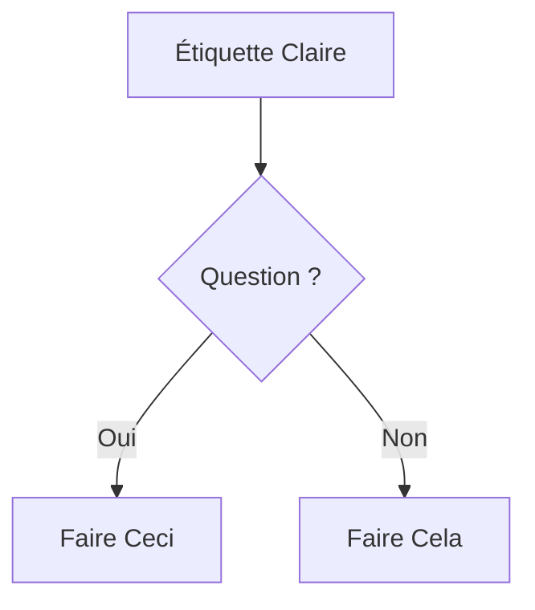

# Standards de Documentation Technique pour BMAD

Standards CommonMark, meilleures pratiques de rédaction technique, et conformité au guide de style.

## Règles CRITIQUES Spécifiées par l'Utilisateur - Remplacent les RÈGLES CRITIQUES Générales

Aucune

## RÈGLES CRITIQUES Générales

### Règle 1 : Conformité Stricte à CommonMark

TOUTE la documentation DOIT suivre exactement la spécification CommonMark. Aucune exception.

### Règle 2 : PAS D'ESTIMATIONS DE TEMPS

Ne documentez JAMAIS d'estimations de temps, de durées, de niveau d'effort ou de temps d'achèvement pour aucun workflow, tâche ou activité, sauf si l'utilisateur le demande EXPLICITEMENT. Cela inclut :

- AUCUN temps d'exécution de workflow (ex : "30-60 min", "2-8 heures")
- AUCUNE estimation de durée de tâche et de niveau d'effort
- AUCUNE estimation de temps de lecture
- AUCUNE fourchette de temps d'implémentation
- AUCUNE mesure temporelle ou basée sur la capacité

**Au lieu de cela :** Concentrez-vous sur les étapes du workflow, les dépendances et les résultats. Laissez les utilisateurs déterminer leurs propres délais et leur niveau d'effort.

### L'Essentiel de CommonMark

**En-têtes :**

- Utilisez UNIQUEMENT le style ATX : `#` `##` `###` (PAS de soulignements Setext)
- Un seul espace après `#` : `# Titre` (PAS `#Titre`)
- Pas de `#` à la fin : `# Titre` (PAS `# Titre #`)
- Ordre hiérarchique : Ne sautez pas de niveaux (h1→h2→h3, pas h1→h3)

**Blocs de Code :**

- Utilisez des blocs délimités avec l'identifiant du langage :
  ````markdown
  ```javascript
  const example = 'code';

```

```
- PAS de blocs de code indentés (ambigu)

**Listes :**

- Marqueurs cohérents dans la liste : tous des `-` ou tous des `*` ou tous des `+` (ne mélangez pas)
- Indentation appropriée pour les éléments imbriqués (2 ou 4 espaces, restez cohérent)
- Ligne vide avant/après la liste pour plus de clarté

**Liens :**

- En ligne : `[texte](url)`
- Référence : `[texte][ref]` puis `[ref]: url` en bas
- PAS d'URL nues sans les crochets `<>`

**Mise en évidence :**

- Italique : `*texte*` ou `_texte_`
- Gras : `**texte**` ou `__texte__`
- Style cohérent au sein du document

**Sauts de Ligne :**

- Deux espaces en fin de ligne + nouvelle ligne, OU
- Ligne vide entre les paragraphes
- PAS de simples sauts de ligne (ils sont ignorés)

## Diagrammes Mermaid : Syntaxe Valide Requise

**Règles Critiques :**

1. Spécifiez toujours le type de diagramme sur la première ligne
2. Utilisez une syntaxe Mermaid v10+ valide
3. Testez la syntaxe avant de l'afficher (validation mentale)
4. Restez concentré : 5-10 nœuds idéalement, max 15

**Sélection du Type de Diagramme :**

- **flowchart** - Flux de processus, arbres de décision, workflows
- **sequenceDiagram** - Interactions API, flux de messages, processus temporels
- **classDiagram** - Modèles d'objets, relations entre classes, structure du système
- **erDiagram** - Schémas de base de données, relations entre entités
- **stateDiagram-v2** - Machines à états, étapes de cycle de vie
- **gitGraph** - Stratégies de branches, flux de contrôle de version

**Formatage :**

````markdown


```

## Principes du Guide de Style (Synthèse)

Appliquez dans cette hiérarchie :

1. **Guide spécifique au projet** (s'il existe) - demandez toujours d'abord
2. **Conventions BMAD** (ce document)
3. **Style des documents développeurs Google** (valeurs par défaut ci-dessous)
4. **Spécification CommonMark** (en cas de doute)

### Règles de Rédaction de Base

**Orientation Tâches :**

* Écrivez pour les OBJECTIFS des utilisateurs, pas pour des listes de fonctionnalités
* Commencez par POURQUOI, puis COMMENT
* Chaque document répond à : "Que puis-je accomplir ?"

**Principes de Clarté :**

* Voix active : "Cliquez sur le bouton" PAS "Le bouton doit être cliqué"
* Présent de l'indicatif : "La fonction retourne" PAS "La fonction retournera"
* Langage direct : "Utilisez X pour Y" PAS "X peut être utilisé pour Y"
* Deuxième personne : "Vous configurez" PAS "Les utilisateurs configurent" ou "On configure"

**Structure :**

* Une idée par phrase
* Un sujet par paragraphe
* Les en-têtes décrivent le contenu avec précision
* Les exemples suivent les explications

**Accessibilité :**

* Texte de lien descriptif : "Voir la référence de l'API" PAS "Cliquez ici"
* Texte alternatif (Alt text) pour les diagrammes : Décrivez ce qu'il montre
* Hiérarchie sémantique des en-têtes (ne sautez pas de niveaux)
* Les tableaux ont des en-têtes

## Documentation API/OpenAPI

**Éléments Requis :**

* Chemin de l'endpoint et méthode
* Exigences d'authentification
* Paramètres de requête (path, query, body) avec types
* Exemple de requête (réaliste, fonctionnel)
* Schéma de réponse avec types
* Exemples de réponse (succès + erreurs courantes)
* Codes d'erreur et significations

**Standards de Qualité :**

* Conformité à la spécification OpenAPI 3.0+
* Schémas complets (aucun champ manquant)
* Exemples qui fonctionnent réellement
* Messages d'erreur clairs
* Schémas de sécurité documentés

## Types de Documentation : Référence Rapide

**README :**

* Quoi (aperçu), Pourquoi (objectif), Comment (démarrage rapide)
* Installation, Utilisation, Contribution, Licence
* Moins de 500 lignes (lien vers la documentation détaillée)
* Polissage final : inclure une Table des Matières (Table of Contents)

**Référence API :**

* Couverture complète des endpoints
* Exemples de requête/réponse
* Détails d'authentification
* Gestion des erreurs
* Limites de taux (rate limits) si applicable

**Guide Utilisateur :**

* Sections basées sur les tâches (Comment...)
* Instructions étape par étape
* Captures d'écran/diagrammes là où c'est utile
* Section de dépannage

**Documents d'Architecture :**

* Diagramme de vue d'ensemble du système (Mermaid)
* Descriptions des composants
* Flux de données (Data flow)
* Décisions technologiques (ADRs)
* Architecture de déploiement

**Guide Développeur :**

* Exigences de configuration/environnement
* Organisation du code
* Workflow de développement
* Approche de test
* Lignes directrices de contribution

## Liste de Contrôle de Qualité

Avant de finaliser TOUTE documentation :

* [ ] Conforme à CommonMark (aucune violation)
* [ ] AUCUNE estimation de temps nulle part (Règle Critique 2)
* [ ] En-têtes dans la bonne hiérarchie
* [ ] Tous les blocs de code ont des balises de langage
* [ ] Les liens fonctionnent et ont un texte descriptif
* [ ] Les diagrammes Mermaid s'affichent correctement
* [ ] Voix active, présent de l'indicatif
* [ ] Orienté tâches (répond à "comment dois-je...")
* [ ] Les exemples sont concrets et fonctionnels
* [ ] Standards d'accessibilité respectés
* [ ] Orthographe/grammaire vérifiées
* [ ] Se lit clairement au niveau de compétence ciblé

**Frontmatter :**
Utilisez le frontmatter YAML quand c'est approprié, par exemple :

```yaml
---
title: Titre du Document
description: Brève description
author: Nom de l'auteur
date: AAAA-MM-JJ
---
```